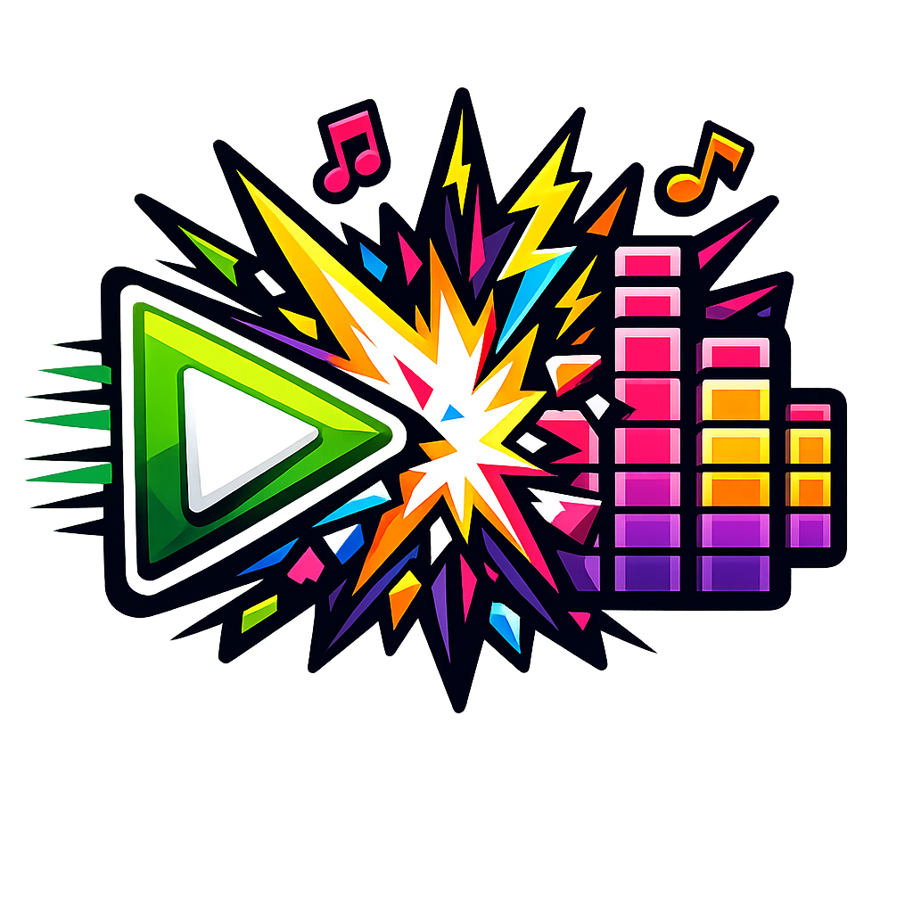

<p align="center">
  
</p>

# 🎵 ClipCrush

**ClipCrush** is a high-stakes music guessing game where teams battle to keep their point balance alive. It’s part DJ battle, part auditory endurance test.

---

## 🚀 Quick Start

Get the game running locally in seconds:

```bash
# Clone the repository
git clone git@github.com:ajrlewis/clipcrush.git

# Install dependencies
pnpm install

# Start the development server
pnpm run dev

```

---

## 🎮 How to Play

### 1. The Setup

* **Starting Balance:** Each team starts with **30 Points**.
* **The Goal:** Be the last team standing. If your balance hits **0 or below**, you're out.

### 2. The Round Structure

Teams alternate between being the **DJ (Challenger)** and the **Listener (Guesser)**.

* The **DJ** selects a song and prepares a 30-second snippet.
* The **Listener** has **5 attempts** to identify the song.
* **Genre Lock:** To keep it fair, the DJ must announce the **Genre** or **Decade** before the first clip plays.

### 3. The Stakes (Point Deductions)

If the Listener guesses incorrectly, points are deducted based on the length of the snippet required:

| Attempt | Length Played | Point Penalty |
| --- | --- | --- |
| **Trial 1** | 1 Second | -1 Point |
| **Trial 2** | 5 Seconds | -3 Points |
| **Trial 3** | 10 Seconds | -5 Points |
| **Trial 4** | 20 Seconds | -10 Points |
| **Trial 5** | 30 Seconds | -15 Points |

### 4. The Reward (Point Recovery)

Speed pays off. Use these mechanics to stay in the game:

* **Instant ID:** Guess correctly on the **1-second** clip to **gain +2 points** (up to the 30-point cap).
* **Standard ID:** Correct guesses on Trials 2–5 result in **0 points lost**, and the turn passes.
* **The "Skip" Mechanic:** Once per game, a team can skip a song for a flat **-5 point** penalty to avoid a deeper loss.

---

## 🏆 Winning the Game

* **Elimination:** When a team’s bank reaches **0**, the opposing team is declared the **Game Champion**.
* **Sudden Death:** If both teams fall below 5 points, the next round triggers **Double Stakes** (all point losses are doubled).

---